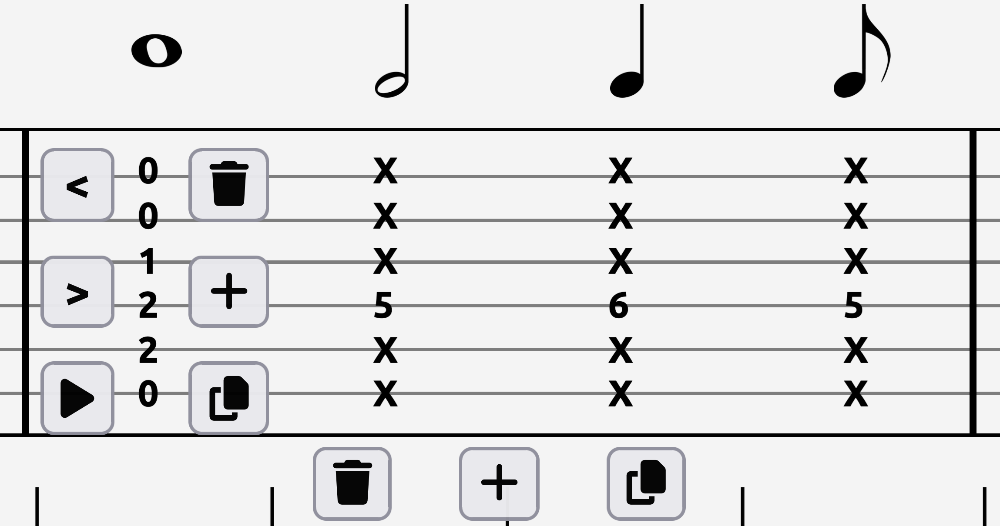

# Guitar Tablature Reader

An interactive web application that allows users to create, edit, and play guitar tablature, with persistent song storage and a virtual fretboard for chord editing.

## Table of Contents

- [What is tablature?](#what-is-tablature)
- [What does this project do?](#what-does-this-project-do)
- [Steps to run locally](#running-locally)

## What is tablature?

Guitar tablature is how guitar music is read, like sheet music for a piano. There are six horizontal lines representing the six strings (EADGBE) on a guitar. The numbers on these lines represent the frets your fingers would go on to play a chord.

For example:

```
E | 0 (This is an E note)
B | 0 (B)
G | 1 (G#)
D | 2 (E)
A | 2 (B)
E | 0 (E)
```

This is an E major chord, which is played like this:
<p>
  
  <p>(Image from https://breakthroughguitar.com/striking-the-right-note-how-do-i-play-an-e-chord-on-guitar/)</p>
</p>

## What does this project do?

This project allows users to seamlessly create and play guitar tablature. Songs are stored in a MySQL database, persist across sessions, and can be browsed or searched directly from the homepage.

When you hover over a measure (the box with lines), you are given 3 options:
-Delete
-Add a new empty measure immediately after the current one
-Duplicate measure and add it immediately after the current one


When you hover over a chord (the stack of numbers), you are given 6 options:
-Shift left
-Shift right
-Play
-Delete
-Add a new empty chord immediately after the current one
-Duplicate chord and add it immediately after the current one


When you click on a chord, you are shown a fretboard. The fretboard has the notes of the selected chord prefilled on all six guitar strings just as they would appear if you were physically playing a guitar. You can modify the chord's notes by clicking anywhere on the fretboard, as well as adjust the chord's duration. A chord can easily turn into a rest by deselecting every note in the chord.


## Running locally

1. **Clone the repository:**

```bash
git clone https://github.com/eborszem/Guitar-Tablature-Reader.git
cd Guitar-Tablature-Reader
```

2. **Configure the database:**

- Update your credentials in `application.properties` (located in website/demo/src/main/resources).

3. **Run the backend:**

```bash
cd website/demo
./mvnw spring-boot:run
```

4. **Access the app:**

- Open your browser at `http://localhost:8080/`.
- Accounts can be created locally within the app.
